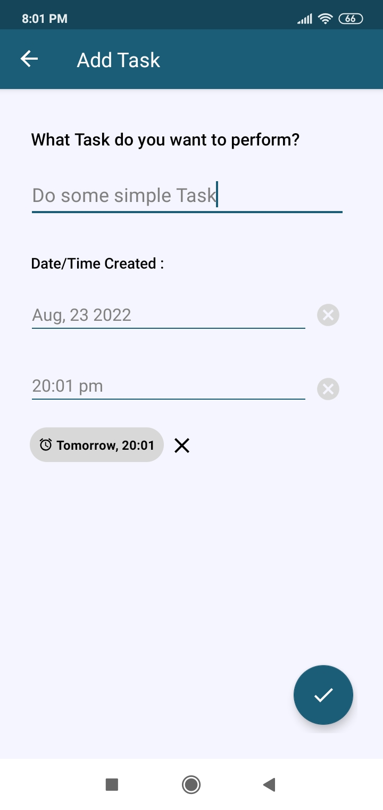
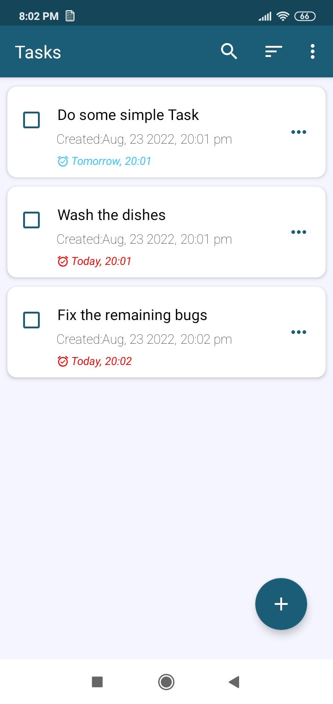
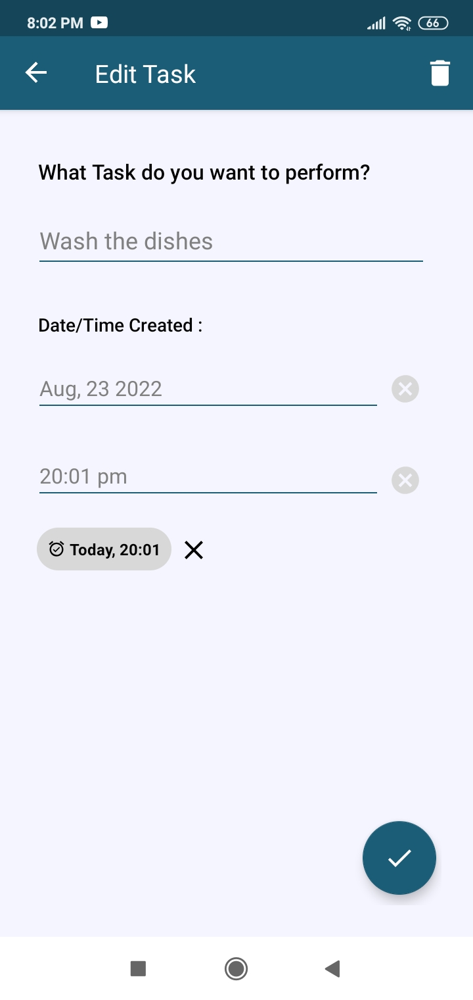
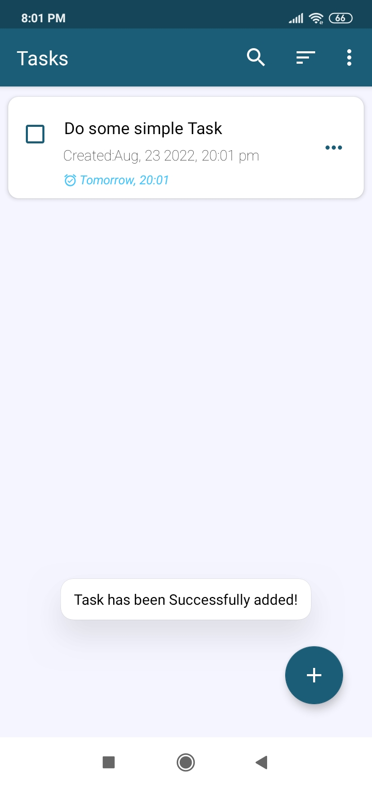

# Todo List

**Todo List** is an App that lets Users keep records of tasks they wish to accomplish.

# Description

The ToDo-List App is an App that can help Users organize and keep track of their daily Tasks and Goals. There is also the option to add Reminders for specific Tasks that the User wishes to accomplish.

# Screenshots

 

 

## About

- This App allows for the Simple creation of Tasks.
- You can set the Date and Time for a being Task created.
- User can set Reminders for one or more Tasks.
- Tasks can be easily searched for, sorted and hidden.

### Developed With

-[Fragments](https://developer.android.com/guide/fragments) - The fragments represents a portion of our App's UI.
-[RecyclerView.Adapter](https://developer.android.com/reference/androidx/recyclerview/widget/RecyclerView.Adapter) - Adapters provide a binding from an app-specific data set to views that are displayed within a RecyclerView.

-[Room](https://developer.android.com/training/data-storage/room) - Room Database used for storing data.
-[Notifications](https://developer.android.com/guide/topics/ui/notifiers/notifications) - A notification is a message that Android displays outside your app's UI to provide the user with reminders.
-[AlarmManager](https://developer.android.com/reference/android/app/AlarmManager) - This is a class that provides access to alarm system services.
-[Flows](https://developer.android.com/kotlin/flow) - Flows is a DataType in Kotlin that can be used to emit multiple values sequentially.
-[JetPackDataStore](https://medium.com/androiddevelopers/introduction-to-jetpack-datastore-3dc8d74139e7) - DataStore is a Jetpack data storage library that provides a safe and consistent way to store small amounts of data.

- [Dagger-Hilt](https://dagger.dev/hilt/) - Standard library to incorporate Dagger dependency injection into an Android application.
- [Retrofit](https://square.github.io/retrofit/) - A type-safe HTTP client for Android and Java.
- [Kotlin Coroutines](https://kotlinlang.org/docs/reference/coroutines-overview.html) - For asynchronous and more..
- [Jetpack Navigation](https://developer.android.com/guide/navigation) - Android Jetpack's Navigation component helps you implement navigation, from simple button clicks to more complex patterns.
